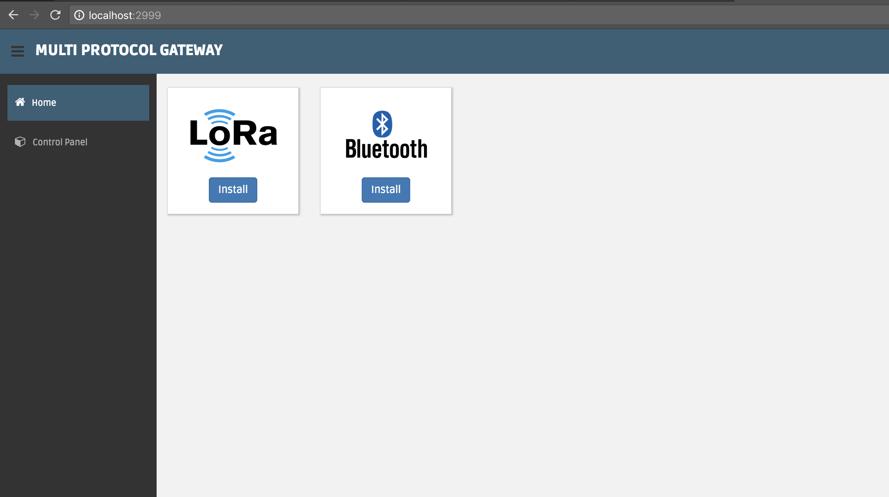

# Multi Protocol Gateway

## About
The scope of this project is to build a nice looking Web Application for a multi protocol gateway which supports bi-directional data transfer with a MQTT Broker for [Bluetooth Low Energy (BLE)](https://github.com/bogdanoniga/ble_gateway) and [LoRa](https://github.com/bogdanoniga/lora_gateway) protocols.

## Web Application

### Home (/)
Features offered by **/**:
- .

[](./public/img/gateway/home.png)

## Development

##### Install environment
**macOS**
```
brew install nodejs nginx
git clone https://github.com/bogdanoniga/multi_protocol_gateway.git
cd ./multi_protocol_gateway
npm install
mv ./configs/nginx.conf /usr/local/etc/nginx/nginx.conf
```

**[Raspbian Stretch Lite (Raspberry Pi)](http://ftp.jaist.ac.jp/pub/raspberrypi/raspbian_lite/images/raspbian_lite-2018-03-14/)**
- Setting up your Raspberry Pi: [RPi setup](https://github.com/bogdanoniga/learning/blob/master/Raspberry/setup.md)

- Setting up Multi Protocol Gateway: `./setup.sh`

- Start/Stop multi_protocol_gateway.service
```
sudo systemctl start multi_protocol_gateway.service
sudo systemctl stop multi_protocol_gateway.service
```

- Read multi_protocol_gateway.service logs
```
journalctl -u multi_protocol_gateway.service -f
```

- Set multi_protocol_gateway.service to run at startup
```
sudo systemctl enable multi_protocol_gateway.service
```

##### Start dev environment

```
# macOS
DEBUG=express-locallibrary-tutorial:* npm run devstart

# Raspbian
DEBUG=express-locallibrary-tutorial:* sudo npm run devstart
```

## Technical Stack

- Express (nodejs) - https://github.com/expressjs/express
- Nginx - https://github.com/nginx/nginx
- Dashgum Bootstrap template - https://github.com/esironal/dashgum-template

## Todo
- [ ] Web Authentication Method (Login User/Pass, Identity Plus)
- [ ] Develop install feature for BLE and LoRa gateways

## MIT License

Copyright (c) 2018 Bogdan Oniga

Permission is hereby granted, free of charge, to any person obtaining a copy
of this software and associated documentation files (the "Software"), to deal
in the Software without restriction, including without limitation the rights
to use, copy, modify, merge, publish, distribute, sublicense, and/or sell
copies of the Software, and to permit persons to whom the Software is
furnished to do so, subject to the following conditions:

The above copyright notice and this permission notice shall be included in all
copies or substantial portions of the Software.

THE SOFTWARE IS PROVIDED "AS IS", WITHOUT WARRANTY OF ANY KIND, EXPRESS OR
IMPLIED, INCLUDING BUT NOT LIMITED TO THE WARRANTIES OF MERCHANTABILITY,
FITNESS FOR A PARTICULAR PURPOSE AND NONINFRINGEMENT. IN NO EVENT SHALL THE
AUTHORS OR COPYRIGHT HOLDERS BE LIABLE FOR ANY CLAIM, DAMAGES OR OTHER
LIABILITY, WHETHER IN AN ACTION OF CONTRACT, TORT OR OTHERWISE, ARISING FROM,
OUT OF OR IN CONNECTION WITH THE SOFTWARE OR THE USE OR OTHER DEALINGS IN THE
SOFTWARE.
